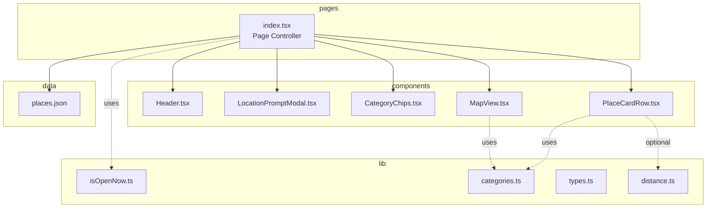
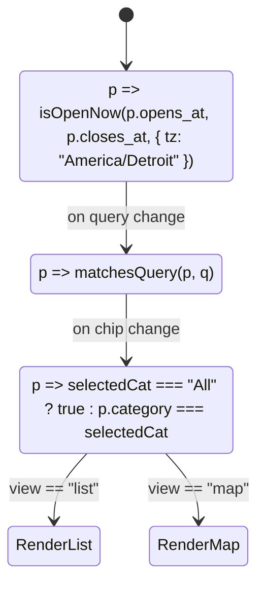

# Architecture & Data Flow

## One-look architecture map


## Data flow & filtering
```mermaid
flowchart LR
  PLJ[places.json] --> IDX[index.tsx]
  IDX -->|1. isOpenNow(Detroit)| OPEN[openNow[]]
  OPEN -->|2. search| SEARCHED[searched[]]
  SEARCHED -->|3. category chips| VISIBLE[visible[]]

  VISIBLE --> CC[CategoryChips]
  VISIBLE --> LIST[List of PlaceCardRow]
  VISIBLE --> MAP[MapView]
```

## Filter state machine

